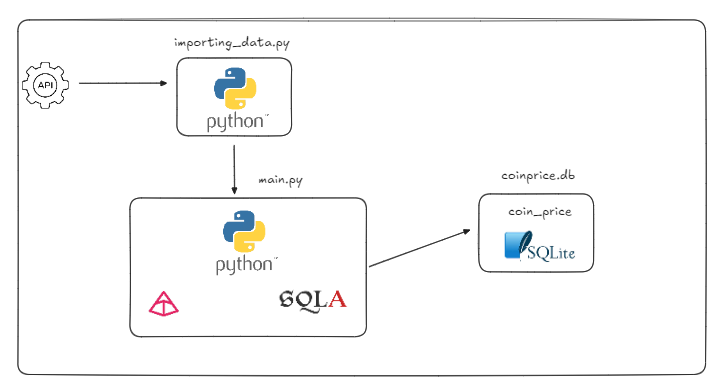

# coin_conversion_project

# Projeto

Este projeto tem como objetivo realizar a extração de dados de uma API pública a partir de um script de python. Após isso, os dados são salvos dentro de um SQLite para utilização do usuário após

# Arquitetura Escolhida

# Tecnologias

As tecnologias utilizadas para o desenvolvimento deste projeto foram as seguintes:

Linguagem de programação: Pyhton
Principais bibliotecas: Pydantic para validação dos dados e SQLAlchemy para comunicação com o banco de dados. 

# Requisitos

- Python 3.12
- [Poetry](https://python-poetry.org/) instalado

# Como rodar o projeto

Após clonar o repositório, certifique-se que o Poetry está instalado em sua máquina. 

- Crie um ambiente virtual e acesse-o
    - poetry init
    - poetry shell

- Instale suas dependências
    - poetry install

Para executar o projeto, será necessário rodar o seguinte script

- Rodando o projeto
    - poetry run python src/main.py

